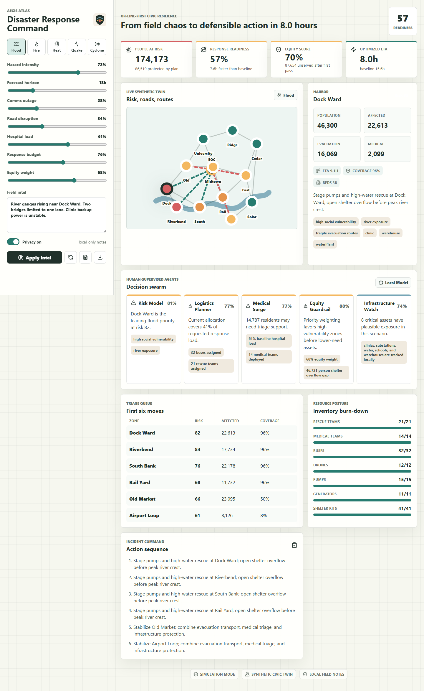
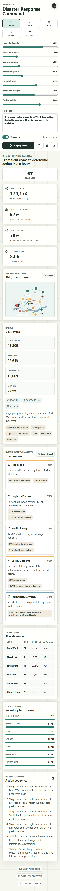

# Aegis Atlas

Offline-first disaster response command simulator for civic resilience demos, hackathons, capstones, and startup validation.

## What It Is

Aegis Atlas turns field notes and crisis assumptions into a defensible incident action plan. It models risk across a synthetic city, prioritizes zones with an equity guardrail, allocates scarce resources, and exports a Markdown or JSON plan without sending sensitive notes to any server.

## Screenshots





This project was built around current opportunity signals:

- Public-sector AI for climate adaptation is moving from research into practical deployment, but barriers remain around fragmented data, under-resourced agencies, equity, and operational trust: https://www.spur.org/events/2026-04-22/ai-climate-adaptation-and-disaster-response-public-sector-pathways-impact
- BCG and the World Economic Forum describe AI, drones, IoT, earth observation, AR/VR, and advanced computing as a toolkit for climate adaptation across risk understanding, resilience, and dynamic response: https://www.bcg.com/about/partner-ecosystem/world-economic-forum/tech-for-climate-adaptation
- Google Cloud frames 2026 agentic AI around systems that orchestrate end-to-end workflows, not one-off prompts: https://cloud.google.com/resources/content/ai-agent-trends-2026
- Edge/offline architectures matter for real-time, privacy-preserving, connectivity-constrained environments: https://flolive.net/blog/glossary/edge-computing-in-2026/

## Why It Stands Out

- Deterministic local simulation engine, not a fragile prompt wrapper.
- Equity-aware resource allocation across evacuation, medical surge, shelters, communications, infrastructure, and logistics.
- Browser-only field-note parsing with sanitization and no external API keys.
- Exportable incident action plans for judges, professors, and stakeholders.
- PWA shell, CSP, local persistence, tests, linting, production build, and visual QA script.

## Quick Start

```bash
npm install
npm run dev
```

Open the local URL shown by Vite.

## Quality Commands

```bash
npm run lint
npm run test
npm run build
npm run check
```

For visual QA, start a preview server first:

```bash
npm run preview -- --host 127.0.0.1
npm run qa:visual
```

The visual QA script writes screenshots to `qa/`.

## Product Flow

1. Choose a hazard: flood, wildfire, heatwave, earthquake, or cyclone.
2. Tune intensity, forecast horizon, outage, road disruption, hospital load, budget, and equity weight.
3. Paste field intel and apply the local inference layer.
4. Inspect the synthetic city twin, priority zones, agent briefs, resource burn-down, and action sequence.
5. Export the incident action plan as Markdown or portable JSON.

## Tech Stack

- React 19
- TypeScript
- Vite
- Vitest and Testing Library
- Playwright visual QA
- lucide-react icons
- Service worker and Web App Manifest

## Project Structure

```text
src/
  domain/
    cityData.ts       Synthetic city and response inventory
    security.ts       Sanitization, normalization, field-note inference
    simulation.ts     Risk model, resource allocation, agent briefs
    report.ts         Markdown and JSON exports
    persistence.ts    Local scenario snapshots
  App.tsx             Command-center UI
  App.css             Responsive operational interface
scripts/
  visual-qa.mjs       Browser screenshot and layout smoke checks
docs/
  ARCHITECTURE.md
  SECURITY.md
  PITCH.md
  BUSINESS_BLUEPRINT.md
  GITHUB_PUBLISH.md
```

## GitHub

Repository:

[github.com/shauryamalhotra957-wq/aegis-atlas](https://github.com/shauryamalhotra957-wq/aegis-atlas)

The repo includes an MIT license, GitHub Actions CI, committed QA screenshots, and a helper script for future pushes:

```powershell
.\scripts\publish-github.ps1
```

## Safety Boundary

Aegis Atlas is a planning simulation and portfolio-grade prototype. It is not live emergency command authority. Real deployment would require verified sensors, official GIS data, emergency-management review, model validation, accessibility audits, privacy review, and incident-command integration.
