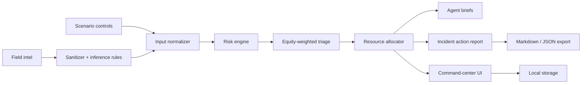

# Architecture

## System View

## Core Design Choices

The simulation is deterministic. That makes it testable, explainable, and safe for a capstone demo because the same scenario produces the same priority order and allocation logic.

The app is offline-first. Field notes are sanitized and processed locally. There are no API keys, no remote inference calls, and no hidden data transfer.

The UI is an operational cockpit. The first screen is the actual product surface: controls, map, risk metrics, agents, inventory, action sequence, and export.

## Simulation Pipeline

1. Normalize scenario values into safe bounded ranges.
2. Score each zone using hazard-specific exposure factors.
3. Add equity weighting for vulnerable populations.
4. Estimate affected population, evacuation demand, medical demand, shelter gap, and threatened infrastructure.
5. Allocate scarce resources by priority while preserving non-negative inventory.
6. Compute coverage, ETA, readiness, people protected, and equity score.
7. Generate agent briefs and incident action plan exports.

## Extension Points

- Replace `CITY_ZONES` with real GIS features.
- Add live sensor adapters behind a validated ingestion layer.
- Swap rule-based field-note inference for a local or private LLM.
- Add official ICS form exports.
- Add multi-city scenario packs.
- Add auditor views for why each allocation was chosen.
